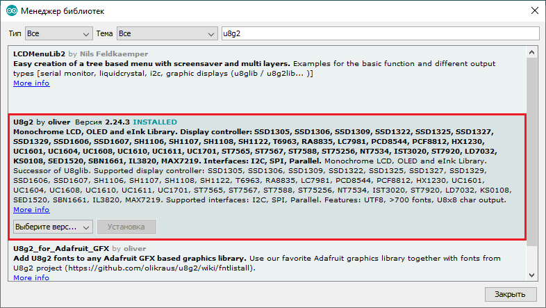
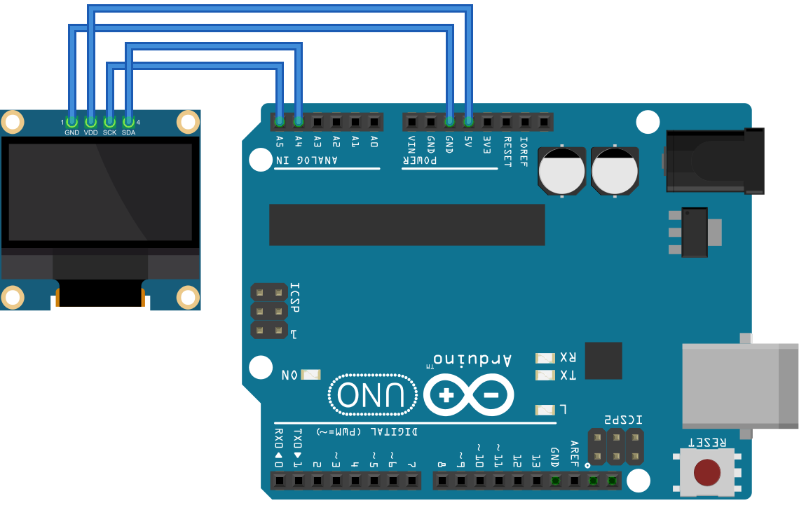

# UnoRetranslator

### This program designed for Arduino Uno

A simple project created in free time with a cup of coffee :-)

First of all, i wanted to create a notifier of important messages from "common" news feed from Telegram using an API of telegram bot.

But throught a few hours when Arduino project was complete, i found out that telegram bot **doesn't have access** for getting list of conversations in "rooms", where bot doesn't have admin rights, and i could't create "common" feed :-(

So, i consider this project just as a good lesson for my low-level skills. 

## What's inside the box?

Oh, there you should find a NodeJS project, that provides us a telegram bot. For correct work you must create a `config.json` file, which contain a little piece of code:
```json
{
  "token": "your_token_here"
}
```
Before it you should create your own bot using a "BotFather" in Telegram. After bot registration, a "BotFather" will give you a token, just paste it to `config.json`.

And don't forget about U8G2 library, you can install it from Sketch > Include Library > Manage Libraries..., just type "u8g2":


## How to connect:

#### On other boards you should check SCL and SDA ports, A4 as SDA and A5 as SCL only on Arduino Uno (or not only).
